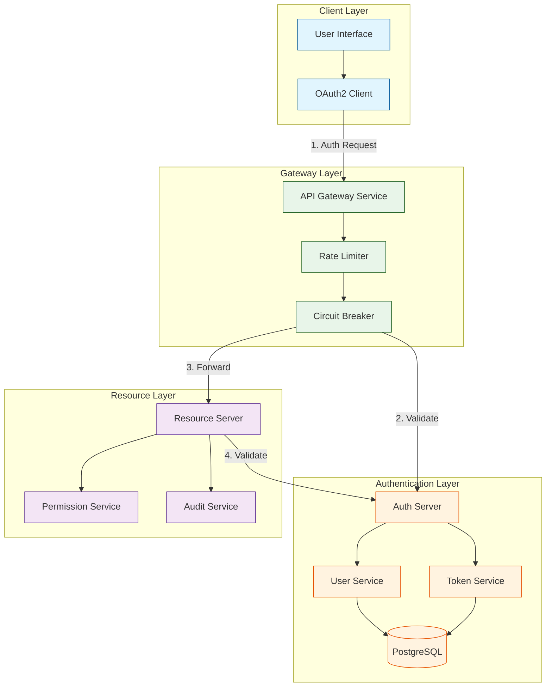
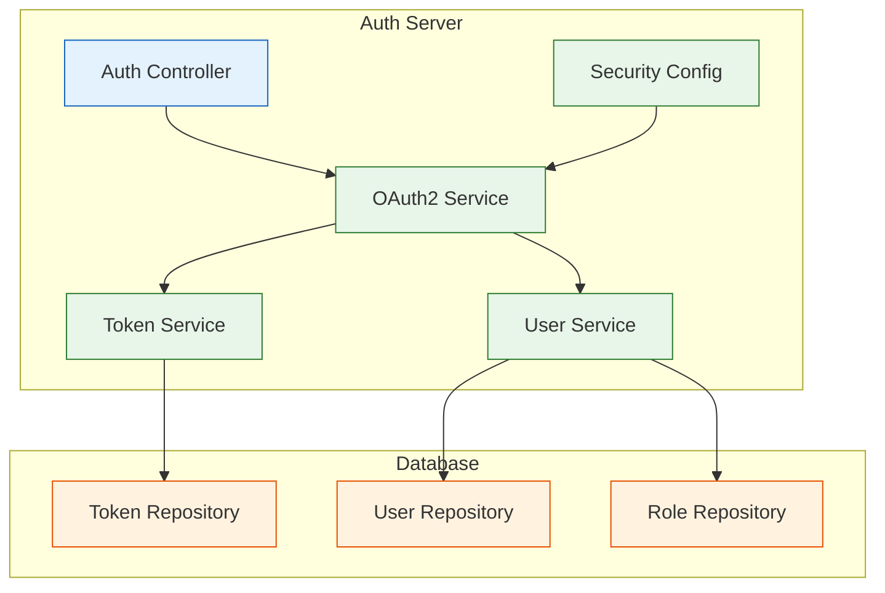
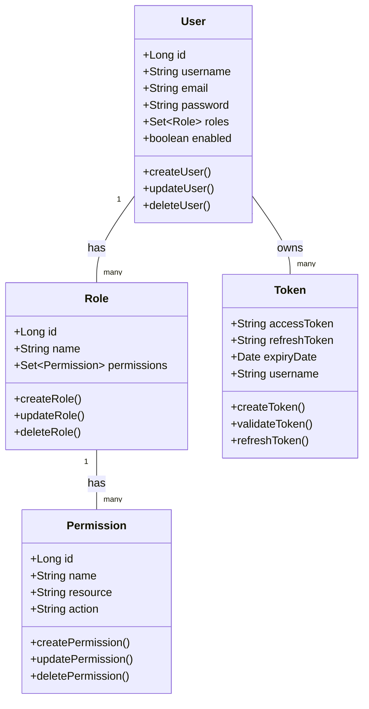
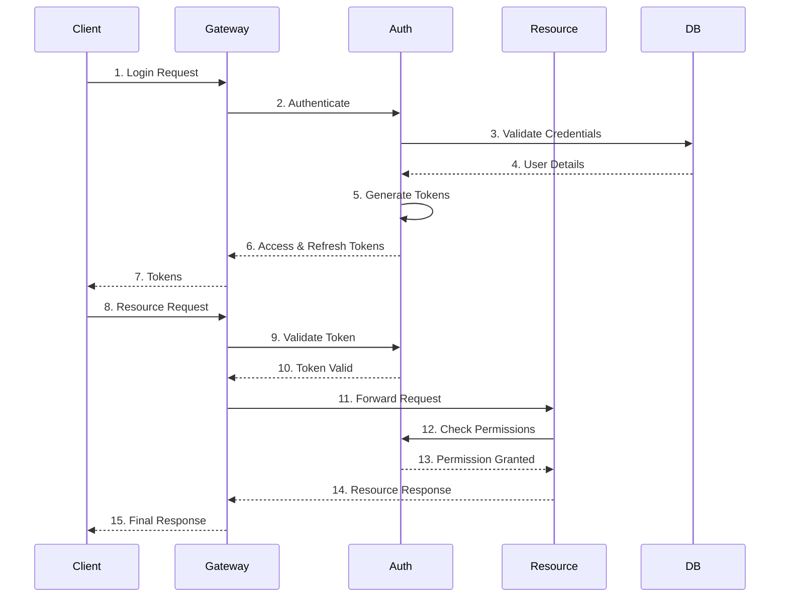
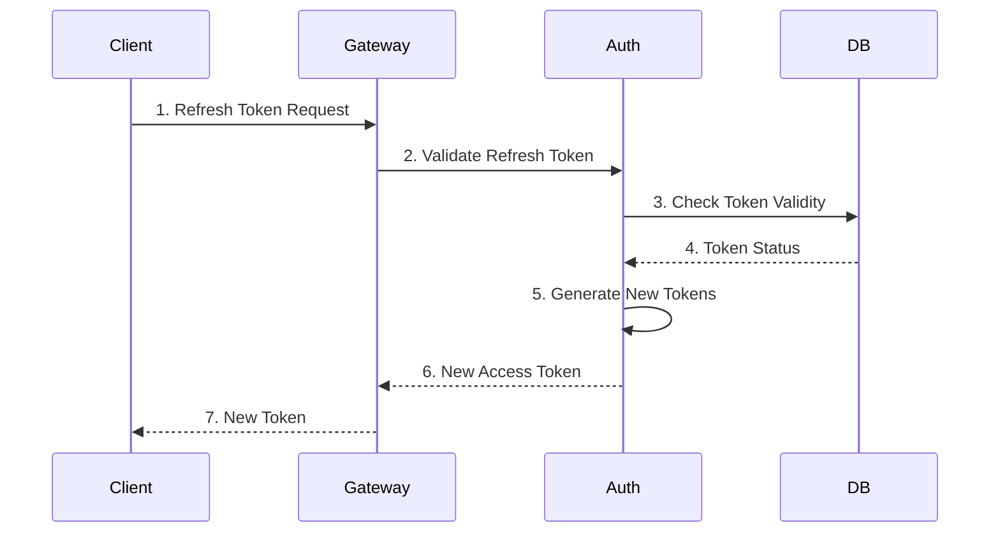

# Sanzee IAM System Documentation

## Table of Contents
1. [System Overview](#system-overview)
2. [Architecture](#architecture)
3. [Component Diagrams](#component-diagrams)
4. [Class Diagrams](#class-diagrams)
5. [Sequence Diagrams](#sequence-diagrams)
6. [Technical Stack](#technical-stack)
7. [Security Architecture](#security-architecture)
8. [Deployment Architecture](#deployment-architecture)

## System Overview

Sanzee IAM is a comprehensive Identity and Access Management system built using Spring Security and OAuth2. The system provides secure authentication, authorization, and user management capabilities through a microservices architecture.

## Architecture

### High-Level Architecture



## Component Diagrams

### Authentication Component



## Class Diagrams

### Core Domain Model



## Sequence Diagrams

### Authentication Flow



### Token Refresh Flow



## Technical Stack

### Backend
- Spring Boot 3.x
- Spring Security
- Spring Cloud Gateway
- Spring Data JPA
- OAuth2
- JWT

### Database
- PostgreSQL
- Redis (for caching)

### Infrastructure
- Docker
- Kubernetes
- AWS/GCP/Azure

## Security Architecture

### Security Layers
1. **Transport Layer Security**
   - HTTPS/TLS
   - Certificate Management
   - Secure Communication

2. **Authentication Layer**
   - OAuth2 Flows
   - JWT Token Management
   - Multi-factor Authentication

3. **Authorization Layer**
   - Role-Based Access Control
   - Resource-Level Permissions
   - Scope-Based Authorization

4. **Data Security**
   - Encryption at Rest
   - Encryption in Transit
   - Secure Password Storage

## Deployment Architecture

```mermaid
graph TB
    subgraph Production Environment
        LB[Load Balancer]
        
        subgraph Gateway Cluster
            G1[Gateway 1]
            G2[Gateway 2]
        end
        
        subgraph Auth Cluster
            A1[Auth Server 1]
            A2[Auth Server 2]
            Cache[(Redis Cache)]
        end
        
        subgraph Resource Cluster
            R1[Resource Server 1]
            R2[Resource Server 2]
        end
        
        subgraph Database Cluster
            DB1[(Primary DB)]
            DB2[(Replica DB)]
        end
    end
    
    LB --> G1
    LB --> G2
    G1 --> A1
    G1 --> A2
    G1 --> R1
    G1 --> R2
    G2 --> A1
    G2 --> A2
    G2 --> R1
    G2 --> R2
    A1 --> Cache
    A2 --> Cache
    A1 --> DB1
    A2 --> DB1
    DB1 --> DB2
    
    classDef prod fill:#f5f5f5,stroke:#333
    classDef cluster fill:#e3f2fd,stroke:#1565c0
    classDef service fill:#e8f5e9,stroke:#2e7d32
    classDef database fill:#fff3e0,stroke:#e65100
    
    class Production Environment prod
    class Gateway Cluster,Auth Cluster,Resource Cluster cluster
    class G1,G2,A1,A2,R1,R2 service
    class DB1,DB2,Cache database
```

## Getting Started

1. Clone the repository
2. Set up PostgreSQL database
3. Configure environment variables
4. Build and run services:
   ```bash
   # Build all services
   mvn clean install
   
   # Run services
   java -jar auth-server/target/auth-server.jar
   java -jar resource-server/target/resource-server.jar
   java -jar gateway-service/target/gateway-service.jar
   java -jar oauth2-client/target/oauth2-client.jar
   ```

## Contributing
Please read CONTRIBUTING.md for details on our code of conduct and the process for submitting pull requests.

## License
This project is licensed under the MIT License - see the LICENSE file for details. 